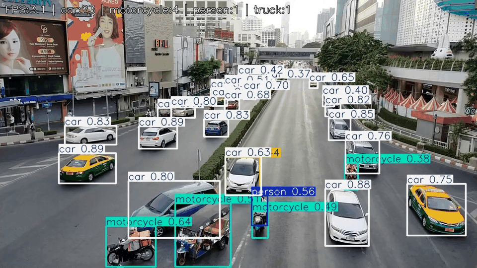

# YOLOv5 Object Detection Pipeline 🚀🎥

A clean, modular, real-time object detection pipeline built on YOLOv5 + PyTorch + OpenCV.
It shows FPS, counts detected objects per frame, renders boxes, and (optionally) saves the video.

---

## ✨ Features

* 🔌 Plug & play: works with webcam (0), video files, or RTSP/HTTP streams
* ⚡️ Fast: GPU (FP16) support + cuDNN benchmarking + OpenCV optimizations
* 🎯 Class filtering: detect only what you care about (people, cars, animals, …)
* 🖼 Overlay: beautiful header with FPS + per-class counts
* 💾 Save or stream: preview live and optionally save output.mp4
* 🧱 Modular: small pipeline.py (orchestrator) + reusable helpers in utils.py

---

## 📁 Project Structure

yolov5-object-detection-pipeline/
│
├── src/
│   ├── pipeline.py        # main loop (orchestration)
│   ├── utils.py           # helpers: model I/O, warmup, infer, render, save
│   └── __init__.py
│
├── requirements.txt
├── README.md
├── .gitignore
└── LICENSE

---

## 🧰 Requirements

Pinned versions that work well together:

torch==2.7.1
torchvision==0.22.1
opencv-python==4.12.0.88
numpy==2.3.2
pillow==11.3.0
PyYAML==6.0.2
requests==2.32.5
tqdm==4.67.1

> YOLOv5 (loaded via torch.hub) implicitly uses numpy, torchvision, pillow, PyYAML, requests, tqdm.
> CUDA is optional but recommended for real-time performance.

---

## 🛠 Installation

# 1) create & activate a virtual environment (recommended)
python -m venv .venv
# Windows
.venv\Scripts\activate
# Linux/Mac
source .venv/bin/activate

# 2) install deps
pip install --upgrade pip
pip install -r requirements.txt

> If you need a specific CUDA build of PyTorch, follow the install selector on pytorch.org, then install the rest.

---

## 🚦 Quick Start

### Webcam (default camera = 0)

python -m src.pipeline

### Video file

python -m src.pipeline examples/sample.mp4

Press Q anytime to quit.

---

## 🧠 What the Pipeline Does (high-level)

* Loads YOLOv5s from ultralytics/yolov5 via torch.hub
* Sets thresholds: conf=0.35, iou=0.45, max_det=300
* Moves to GPU if available, enables FP16 on CUDA
* Warms up the model (one dummy forward) for snappy first frame
* Reads frames → infers → draws boxes → writes header FPS + counts
* Optionally saves to output.mp4

---

## 🎛 Customization

### 1) Choose which classes to detect

In src/utils.py:

WANT = {
  'person','car','truck','bus','motorcycle',
  'bicycle','dog','cat','bird','horse','cow','sheep'
}

> YOLOv5’s model.classes is set from this set, handling both list/dict model.names.

### 2) Change thresholds / input size

In load_model():

model.conf = 0.35     # confidence
model.iou  = 0.45     # NMS IoU
model.max_det = 300

In pipeline.py:

infer_size = 640      # typical sizes: 640, 512

### 3) Save video toggle / path

In pipeline.py:

save_flag = True
out_path  = 'output.mp4'

---

## 📸 Demo (add your media)

## Demo

Place a short GIF in examples/demo.gif to showcase the pipeline.

---

## 🧩 Code Highlights

### Optimizations

cv2.setUseOptimized(True)
torch.backends.cudnn.benchmark = True  # best algorithm for fixed-size inputs

### Device & FP16

DEVICE = 'cuda' if torch.cuda.is_available() else 'cpu'
if DEVICE == 'cuda':
    model.half()  # FP16 for speed & memory

### Clean inference-only mode

@torch.no_grad()
def infer(model, image, size=640):
    model.eval()
    return model(image, size=size)

### Fast overlay

vis = result.render()[0]
cv2.putText(vis, head, (10, 26), cv2.FONT_HERSHEY_SIMPLEX, 0.7, (0,0,0), 2, cv2.LINE_AA)
cv2.putText(vis, head, (10, 26), cv2.FONT_HERSHEY_SIMPLEX, 0.7, (255,255,255), 1, cv2.LINE_AA)

---

## ⚙️ Tips & Performance

* Keep input size constant → cudnn.benchmark=True shines.
* On Windows, if webcam is laggy, try:

  cap = cv2.VideoCapture(0, cv2.CAP_DSHOW)  # or CAP_MSMF
  
* For network streams (RTSP/HTTP), increase robustness with retries and timeouts.
* If you see NumPy / OpenCV ABI issues, try aligning NumPy to <2.3 or reinstall OpenCV.

---

## 🧪 Notebook

Use notebooks/demo.ipynb to quickly test the pipeline with images/videos and tweak thresholds interactively.

---

## 🐛 Troubleshooting

* Torch hub can’t download YOLOv5
  → Ensure internet access or clone ultralytics/yolov5 locally and load from path.
* `RuntimeError: CUDA error`
  → Update GPU driver, match PyTorch CUDA build, reduce input size to 512.
* Black window / no frames
  → Wrong src, missing codecs, or blocked camera. Try a known .mp4 in examples/.
* Video writer file is empty
  → Check codec support; try mp4v, XVID, or change container to .avi.

---

## 🙌 Acknowledgements

* Model loading and utilities inspired by Ultralytics YOLOv5
* Built with PyTorch, OpenCV, and the Python ecosystem

---

## 📄 License 

This project is released under the MIT License.
See [LICENSE](./LICENSE) for details.

---

## ⭐️ Support

If this project helps you, consider giving it a star on GitHub!
PRs and issues are welcome.
